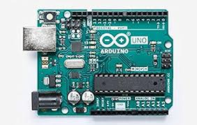
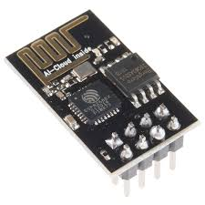
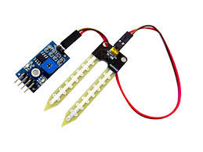
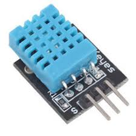

<h1 align="center">Forest-Buddy</h1>

## Inspiration

Bushfires in Australia are a widespread and regular occurrence that have contributed significantly to shaping the nature of the continent over millions of years. However, the fires can cause significant property damage and loss of both human and animal life. Bushfires have killed approximately 800 people in Australia since 1851, and billions of animals. 

## What it does

Forest Buddy is an inexpensive solution to forest fires. A box that can be easily installed near trees to quickly detect fire as it starts and report the concerned authorities. It costs very less to make and can help reduce the damages done by forest fires.

## How we Built it

We have used Soil Moisture Sensor,Gas Sensor, Temperature Sensor, Humdidity Sensor and ESP8266 to push the data into the `firebase Realtime DataBase`. The web app was built with `HTML`, `CSS`, `JavaScript`, `FireBase`, `Bootstrap`, and `Google Charts` and `amCharts APIs`.

## Tools
| Logo | Tool |
| --- | --- |
|  | Arduino Uno for computation |
|  | Access over Wifi Network |
|  |  To detect smoke and carbon monoxide from Fire |
|  | To keep a watch on Moisture levels of Soil |
|  | To keep a watch on Temperature and Humidity levels |

## Challenges we ran into  

Figuring out how to assemble the hardware into a small form was one of the most difficult parts. We wanted the hardware to be cost effective and light-weight. We are most proud of the UI/UX design that animates upon loading, giving the app a modern feel. 

## Accomplishments that we are proud of

Creating a project which helps our environment and community. Working in unison despite being far away from each other. Completing this awesome project within a very short amount of time.

## What we learned

We learned to create a dynamic and modern application that helps conserve water. Each one of our team members improved our software and hardware skills. We did research to see what made a modern app visually appealing and attempted for a minimalist look. 

## What's Next for Forest-Buddy ?

We could further develop the system into a mesh network. This network will further increase the range of the system and we would be able to detect fire anywhere in the forest and report it to the respective authorities. 

## Contributors :sparkles:
<table>
<tr>
    <td align="center">
        <a href="https://github.com/atharwa-24">
            
             
            <b>Atharwa_24</b>
        </a>
    </td>
    <td align="center">
        <a href="https://github.com/omkhairate">
            
             
            <b>Om Khairate</b>
        </a>
    </td>
    <td align="center">
        <a href="https://github.com/DhawalKhapre">
            
             
            <b>Dhawal Khapre</b>
        </a>
    </td>
    <td align="center">
        <a href="https://github.com/tejas2806">
            
             
            <b>Tejas Khairnar</b>
        </a>
    </td>
    </tr>
</table>
